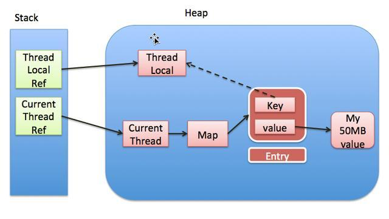
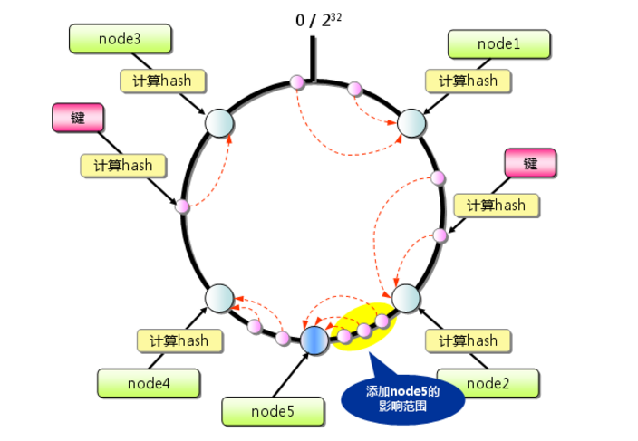
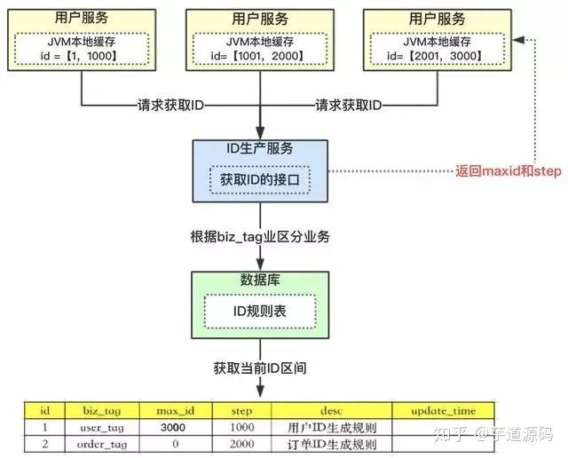

# 面试

> 为节约答题时间，手写答案较费时的题可回答“面谈”，不会的题留空，每题简明扼要回答即可，时间不超过400分钟

## 1、volatile变量的作用？

**答案；volatile的作用，**    
 * 1、保证变量的可见性 
 * 2、保证变量的有序性(防止指令重排序)
 * 3、**不保证**变量的原子性
 
**首先我们由JMM模型可知，只有同时满足可见性、有序性、原子性。才能保证并发安全，由于volatile不能保证原子性。所以只使用volatile是无法做到线程安全的。**

### volatile原理

为了提高处理器的执行速度，在处理器和内存之间增加了多级缓存来提升。但是由于引入了多级缓存，就存在缓存不一致问题。

但是，对于volatile变量，当对volatile变量进行写操作的时候，JVM会向处理器发送一条lock前缀的指令，将这个缓存中的变量写回到主内存中。

但是就算写回到内存，如果其他处理器缓存的值还是旧的，在执行计算机操作就会有问题，所以在多处理器下，为了保证各个处理器的缓存一致，就
会实现一致性协议。

缓存一致性协议：每个处理器通过嗅探在总线上传播的数据来检查自己缓存的值是不是过期了，当处理器发现自己缓存对应的内存地址被修改，就会将当前
处理器的缓存行设置成无状态，当处理器要对这个数据进行修改操作的时候，会强制重新从系统内存里把数据读到处理器缓存里

所以，如果一个变量被volatile所修饰的话，在每次数据变化之后，其值都会被强制刷入主存。而其他处理器的缓存由于遵循了缓存一致性协议，也会
把这个变量的值从主存加载到自己的缓存中。这就保证了一个volatile在并发编程中，其值在多个缓存中是可见的。

### volatile可见性 

可见性是指当多个线程访问同一个变量时，一个线程修改了这个变量的值，其他线程能够立即看到修改的值。

java内存模型规定了所有的变量都储存在主内存中，每条线程还有自己的工作内存，线程工作内存中保存了该线程中是用到的变量的主内存副本拷贝，
线程对变量的所有操作都必须在工作内存中进行，而不能直接读写主内存。不同的线程之间无法直接访问对方的工作内存中的变量，线程间变量的
传递均需要自己的工作内存和主存之间进行数据同步进行。所以，就可能出现线程1改了某个变量的值，但是线程2不可见的情况。

前面的关于volatile的原理中介绍过了，java中的volatile关键字提供一个功能，那就是被其修饰的变量在被修改后可以立即同步到主内存，
被其修饰的变量在每次使用之前都从主内存刷新。因此，可以使用volatile来保证多线程操作时变量的可见性。

### volatile有序性

有序性即程序执行的顺序安照代码的先后顺序执行。

除了引入了时间片以外，由于处理器优化和指令重排等，CPU还可以对输入代码进行乱序执行，比如load->add->sava有可能别优化成
load->save->add。这就是可能存在有序性问题。

而volatile除了可以保证数据的可见性之外，还有一个强大的功能，那就是他可以禁止指令重排优化等。

普通的变量仅仅会保存在该方法的执行过程中锁依赖的赋值结果的地方都能获得正确的结果，而不能保证变量的赋值操作的顺序与程序代码
中的执行顺序一致。

volatile可以禁止指令重排，这就保证了代码的程序会严格按照代码的先后顺序执行。这就保证了有序性，被volatile修饰的变量的操作，
会严格按照代码顺序执行，load->add->save的执行顺序就是： load、add、save

### volatile于原子性

**原子性是指一个操作是不可中断的，要全部执行完成，要不就都不执行。**

线程是CPU调度的基本单位。CPU有时间片的概念，会根据不同的调度算法进行线程调度。当一个线程获得时间片之后开始执行，在时间片耗尽之后，
就会失去CPU使用权。所以在多线程场景下，由于时间片在线程间轮换，就会发生原子性问题。

为了保证原子性，需要通过字节指令monitorenter和monitorexit，但是volatile和这两个指令之间是没有任何关系的。

所以，volatile是不能保证原子性得。

在以下两个场景中可以使用volatile来代替synchronized：

 * 1、运算结果并不依赖变量得当前值，或者能够确保只有单一的线程会修改变量的值。
 * 2、变量不需要与其他状态变量共同参与不变约束。

除以上场景外，都需要使用其他方式来保证原子性，如synchronized或者concurrent包。

``volatile和原子性的例子``

```java
public class Test {
    public volatile int inc = 0;

    public void increase() {
        inc++;
    }

    public static void main(String[] args) {
        final Test test = new Test();
        for (int i = 0; i < 10; i++) {
            new Thread(() -> {
                for (int j = 0; j < 1000; j++) {
                    test.increase();
                }
            }).start();

        }
        //保证前面的线程都执行完
        while (Thread.activeCount() > 1)
        {
            Thread.yield();
        }
        System.out.println(test.inc);
    }
}
```

以上代码比较简单，就是创建10个线程，然后分别执行1000次i++操作。正常情况下，程序的输出结果应该是10000，但是，多次执行的结果都小于10000。这其实就是volatile无法满足原子性的原因。

为什么会出现这种情况呢，那就是因为虽然volatile可以保证inc在多个线程之间的可见性。但是无法inc++的原子性。

总结与思考: **现在我们知道，synchronized可以保证原子性、有序性和可见性。而volatile却只能保证有序性和可见性。**

## 2、列出JDK中自动支持排序的集合？

**TreeSet支持自动排序，TreeSet底层数据结构是红黑树。(唯一，有序)**


```java
TreeSet实现了comparator接口，由此可知TreeSet自动支持排序
public interface SortedSet<E> extends Set<E> {
    /**
     * Returns the comparator used to order the elements in this set,
     * or <tt>null</tt> if this set uses the {@linkplain Comparable
     * natural ordering} of its elements.
     *
     * @return the comparator used to order the elements in this set,
     *         or <tt>null</tt> if this set uses the natural ordering
     *         of its elements
     */
    Comparator<? super E> comparator();
```


## 3、JDK中的LinkedList 节点结构如下，补充其完整的节点属性：
```java
    class Node<E>{

    }
```

```java
private static class Node<E> {
    E item;
    Node<E> next;
    Node<E> prev;
    
    Node(Node<E> prev, E element, Node<E> next){
        this.item = element;
        this.next = next;
        this.prev = prev;
    }
}
```

## 4、写出以下集合各种操作的平均时间复杂度(大O表示、如O(n))
```
    ArrayList 查询指定元素：   查询指定下标的元素：  增加元素；
    LikedList 查询指定元素：   查询指定下标的元素：  增加元素；
    Map 查询指定的元素：  增加元素；
```

```java
ArrayList是线性表(数组支持随机访问)
get()直接读取第几个下标，复杂度O(1)
add(E)添加元素，直接在后面添加，复杂度O(1)
add(index,E)添加元素，在第几个元素后面插入，后面的元素需要向后移动，复杂度O(n)
remove()删除元素，后面的元素需要逐个移动，复杂度O(n)

总结：查O(1) 增 末尾O(1) 中间O(n) 删O(n)
移动是消耗时间复杂度的

LinkedList双链表(首尾操作非常快)
get()获取第几个元素，依次遍历，复杂度O(n)
add(E)添加到末尾，复杂度O(1)
add(index,E)添加第几个元素后，需要先查找到第几个元素，直接指针操作，复杂度O(n)
remove()删除元素，直接指针指向操作，复杂度O(1)

总结: 查O(n) 增 末尾O(1) 中间O(n) 删O(1)

扩展Set

Set集合有三个常见的实现类：HashSet,TreeSet,LinkedHashSet.
简单的说，如果你关注性能，应该使用HashSet；
如果你需要一个有序的Set集合，应该使用TreeSet；
如果你需要一个Set集合保存了原始的元素插入顺序，应该使用LinkedHashSet。

HashSet是基于散列表实现的，元素没有顺序；add、remove、contains方法的时间负杂度为O(1)。
总结：查O(1)  增O(1) 删O(1)

TreeSet是基于树实现的(红黑树),元素是有序的：add、remove、contains方法的时间复杂度为O(log (n))
总结：查O(log n) 增O(log n) 删O(log n)
因为元素是有序的，它提供了若干个相关方法如first(), last(), headSet(), tailSet()等；
LinkedHashSet介于HashSet和TreeSet之间，是基于哈希表和链表实现的，支持元素的插入顺序；
基本方法的时间复杂度为O(1);

待定
总结： 查O(1) 增O(1) 删O(1)

扩展Map

map集合有三个常用的实现类： HashMap， TreeMap， LinkedHashMap。

TreeMap基于红黑树(一种自平衡二叉查找树)实现的，时间复杂度平均能到达O(log n)。
HashMap是基于散列表实现的，时间复杂度平均能达到O(1)。正常是O(1)到O(n) jdk1.8添加了红黑树 是O(log n)

TreeMap的get操作的时间复杂度是O(log (n))的，相比于HashMap的O(1)还是差不少的。
LinkedHashMap的出现就是为平衡这些因素，能以O(1)时间复杂度查找元素，又能报增可以的有序性

```

**数据结构决定特性，好的算法决定效率**


**优秀的程序员=数据结构+算法(而不是API工程师)**
 
## 5、列出解决Hash冲突的多种方法：
    
 * 1、开放定址法

    这种方法也称再散列法，其基本思想是：当关键字key的哈希地址p=H（key）出现冲突时，以p为基础，产生另一个哈希地址p1，如果p1仍然冲突，再以p为基础，产生另一个哈希地址p2，…，直到找出一个不冲突的哈希地址pi ，将相应元素存入其中。这种方法有一个通用的再散列函数形式：
    Hi=（H（key）+di）% m   i=1，2，…，n
    其中H（key）为哈希函数，m 为表长，di称为增量序列。增量序列的取值方式不同，相应的再散列方式也不同。主要有以下三种：

  * 1、线性探测再散列

    dii=1，2，3，…，m-1

    这种方法的特点是：冲突发生时，顺序查看表中下一单元，直到找出一个空单元或查遍全表。

   * 2、 二次探测再散列

    di=12，-12，22，-22，…，k2，-k2    ( k<=m/2 )

    这种方法的特点是：冲突发生时，在表的左右进行跳跃式探测，比较灵活。

   * 3、伪随机探测再散列

    di=伪随机数序列。

    具体实现时，应建立一个伪随机数发生器，（如i=(i+p) % m），并给定一个随机数做起点。
 * 2、再哈希法
   
        这种方法是同时构造多个不同的哈希函数：    
        Hi=RH1（key）  i=1，2，…，k   
        当哈希地址Hi=RH1（key）发生冲突时，再计算Hi=RH2（key）……，直到冲突不再产生。这种方法不易产生聚集，但增加了计算时间。
 * 3、链地址法(HashMap使用的是此方法)  
         这种方法的基本思想是将所有哈希地址为i的元素构成一个称为同义词链的单链表，并将单链表的头指针存在哈希表的第i个单元中，因而查找、插入和删除主要在同义词链中进行。链地址法适用于经常进行插入和删除的情况。
 * 4、建立公共溢出区  
         这种方法的基本思想是：将哈希表分为基本表和溢出表两部分，凡是和基本表发生冲突的元素，一律填入溢出表
         
## 6、Stack和Queue的特性分别是什么？

* 1.stack堆栈，没有迭代器，支持push()方法。后进先出,top()返回最顶端的元素,pop()剔除最顶元素，后进先出（LIFO）；

* 2.deque双端队列，支持迭代器，有push_back()方法，跟vector差不多，比vector多了个pop_front,push_front方法；

* 3.queue队列，先进先出，不支持迭代器。队列通常（但并非一定）以 FIFO（先进先出）的方式排序各个元素。Queue使用时要尽量避免Collection的add()和remove()方法，而是要使用offer()来加入元素，使用poll()来获取并移出元素。它们的优点是通过返回值可以判断成功与否，add()和remove()方法在失败的时候会抛出异常。 如果要使用前端而不移出该元素，使用element()或者peek()方法。

扩展Queue

|方法类型|抛出异常|特殊值|
|---|---|---|
|插入|add(e)|offer(e)|
|移除|remove()|poll()|
|检查|element()|peek()|


LinkedList间接实现类Queue

## 7、Synchronized与lock的区别？synchronized分别在类的普通方法和静态那方法上分别锁什么？

1）synchronized属于JVM层面，属于java的关键字

 * monitorenter（底层是通过monitor对象来完成，其实wait/notify等方法也依赖于monitor对象 只能在同步块或者方法中才能调用 wait/ notify等方法）  
 
 * Lock是具体类（java.util.concurrent.locks.Lock）是api层面的锁
 
2）使用方法：

 * synchronized：不需要用户去手动释放锁，当synchronized代码执行后，系统会自动让线程释放对锁的占用

 * ReentrantLock：则需要用户去手动释放锁，若没有主动释放锁，就有可能出现死锁的现象，需要lock() 和 unlock() 配置try catch语句来完成

3）等待是否中断

 * synchronized：不可中断，除非抛出异常或者正常运行完成
 * ReentrantLock：可中断，可以设置超时方法
    * 设置超时方法，trylock(long timeout, TimeUnit unit)
    * lockInterrupible() 放代码块中，调用interrupt() 方法可以中断
    
4）加锁是否公平

 * synchronized：非公平锁
 * ReentrantLock：默认非公平锁，构造函数可以传递boolean值，true为公平锁，false为非公平锁
 
5）锁绑定多个条件Condition

 * synchronized：没有，要么随机，要么全部唤醒
 * ReentrantLock：用来实现分组唤醒需要唤醒的线程，可以精确唤醒，而不是像synchronized那样，要么随机，要么全部唤醒
 
结论：synchronized在类的普通方法锁的是对象，在静态那方法上锁定的是class

synchronized对类的当前实例进行加锁，防止其他线程同时访问该类的该实例的所有synchronized块，注意这里是“ 类的当前实例 ”，类的两个不同实例就没有这种约束了

static synchronized恰好就是要控制类的所有实例的访问了，static synchronized是限制线程同时访问jvm中该类的所有实例同时访问对应的代码块。实际上，在类中某方法或某代码块中有 synchronized，那么在生成一个该类实例后，该类也就有一个监视块，放置线程并发访问该实例synchronized保护块， 而 static synchronized 则是所有该类的实例公用一个监视块了 ，也就是两个的区别了,也就是synchronized相当于this.synchronized，而staticsynchronized相当于Something.synchronized.


## 8、ThreadLocal中的对象什么时候被GC回收？

先看下ThreadLocal的 get()和set()？


从set方法我们可以看到，首先获取到了当前线程t，然后调用getMap获取ThreadLocalMap，如果map存在，则将当前线程对象t作为key，要存储的对象作为value存到map里面去。如果该Map不存在，则初始化一个。

OK，到这一步了，相信你会有几个疑惑了，ThreadLocalMap是什么，getMap方法又是如何实现的。带着这些问题，继续往下看。先来看ThreadLocalMap。


我们可以看到ThreadLocalMap其实就是ThreadLocal的一个静态内部类，里面定义了一个Entry来保存数据，而且还是继承的弱引用。在Entry内部使用ThreadLocal作为key，使用我们设置的value作为value。

还有一个getMap

```java
ThreadLocalMap getMap(Thread t) {

return t.threadLocals;

}
```

调用当期线程t，返回当前线程t中的成员变量threadLocals。而threadLocals其实就是ThreadLocalMap。


通过上面ThreadLocal的介绍相信你对这个方法能够很好的理解了，首先获取当前线程，然后调用getMap方法获取一个ThreadLocalMap，如果map不为null，那就使用当前线程作为ThreadLocalMap的Entry的键，然后值就作为相应的的值，如果没有那就设置一个初始值。

OK，其实内部源码很简单，现在我们总结一波

（1）每个Thread维护着一个ThreadLocalMap的引用

（2）ThreadLocalMap是ThreadLocal的内部类，用Entry来进行存储

（3）ThreadLocal创建的副本是存储在自己的threadLocals中的，也就是自己的ThreadLocalMap。

（4）ThreadLocalMap的键值为ThreadLocal对象，而且可以有多个threadLocal变量，因此保存在map中

（5）在进行get之前，必须先set，否则会报空指针异常，当然也可以初始化一个，但是必须重写initialValue()方法。

（6）ThreadLocal本身并不存储值，它只是作为一个key来让线程从ThreadLocalMap获取value。

OK，现在从源码的角度上不知道你能理解不，对于ThreadLocal来说关键就是内部的ThreadLocalMap。

**结论：**


ThreadLocalMap是一个定制的哈希映射，仅适用于维护线程本地值。为了帮助处理非常大和长期使用的用法，哈希表条目使用weakreferences作为键。但是，由于不使用引用队列，因此只有当表开始耗尽空间时，才保证删除过时的条目。（源码注释）


ThreadLocalMap是使用ThreadLocal的弱引用作为Key的（注意：Value并非弱引用），Key只能是ThreadLocal对象，从而实现了变量访问在不同线程中的隔离。**当一个ThreadLocal失去强引用，生命周期只能存活到下次gc前**，此时ThreadLocalMap中就会出现key为null的Entry，当前线程无法结束，这些key为null的Entry的value就会一直存在一条强引用链，造成内存泄露

解决方案：

建议将ThreadLocal变量定义成private static的，在调用ThreadLocal的get()、set()方法完成后，再调用remove（）方法，手动删除不再需要的ThreadLocal。

使用注意：

如果Thread是从Thread Pool中取出，它可能会被复用，此时就一定要保证这个Thread在上一次结束的时候，其关联的ThreadLocal被清空掉，否则就会串到下一次使用。


扩展下ThreadLocal内存泄漏问题

我们先来看下面这张图。



上面这张图详细的揭示了ThreadLocal和Thread以及ThreadLocalMap三者的关系。

1、Thread中有一个map，就是ThreadLocalMap

2、ThreadLocalMap的key是ThreadLocal，值是我们自己设定的。

3、ThreadLocal是一个弱引用，当为null时，会被当成垃圾回收

4、重点来了，突然我们ThreadLocal是null了，也就是要被垃圾回收器回收了，但是此时我们的ThreadLocalMap生命周期和Thread的一样，它不会回收，这时候就出现了一个现象。那就是ThreadLocalMap的key没了，但是value还在，这就造成了内存泄漏。

解决办法：使用完ThreadLocal后，执行remove操作，避免出现内存溢出情况。

## 9、JAVA中线程状态分别有哪些？


Java中线程的状态分为6种。

```
1. 初始(NEW)：新创建了一个线程对象，但还没有调用start()方法。
2. 运行(RUNNABLE)：Java线程中将就绪（ready）和运行中（running）两种状态笼统的称为“运行”。
线程对象创建后，其他线程(比如main线程）调用了该对象的start()方法。该状态的线程位于可运行线程池中，等待被线程调度选中，获取CPU的使用权，此时处于就绪状态（ready）。就绪状态的线程在获得CPU时间片后变为运行中状态（running）。
3. 阻塞(BLOCKED)：表示线程阻塞于锁。
4. 等待(WAITING)：进入该状态的线程需要等待其他线程做出一些特定动作（通知或中断）。
5. 超时等待(TIMED_WAITING)：该状态不同于WAITING，它可以在指定的时间后自行返回。
6. 终止(TERMINATED)：表示该线程已经执行完毕。
```
* 线程的状态图  

 

这6种状态定义在Thread类的State枚举中，可查看源码进行一一对应。

 * 1. 初始状态
 
实现Runnable接口和继承Thread可以得到一个线程类，new一个实例出来，线程就进入了初始状态。

 * 2.1. 就绪状态
 
就绪状态只是说你资格运行，调度程序没有挑选到你，你就永远是就绪状态。
调用线程的start()方法，此线程进入就绪状态。
当前线程sleep()方法结束，其他线程join()结束，等待用户输入完毕，某个线程拿到对象锁，这些线程也将进入就绪状态。
当前线程时间片用完了，调用当前线程的yield()方法，当前线程进入就绪状态。
锁池里的线程拿到对象锁后，进入就绪状态。
 * 2.2. 运行中状态
 
线程调度程序从可运行池中选择一个线程作为当前线程时线程所处的状态。这也是线程进入运行状态的唯一一种方式。

 * 3. 阻塞状态
 
阻塞状态是线程阻塞在进入synchronized关键字修饰的方法或代码块(获取锁)时的状态。

 * 4. 等待
 
处于这种状态的线程不会被分配CPU执行时间，它们要等待被显式地唤醒，否则会处于无限期等待的状态。

 * 5. 超时等待
 
处于这种状态的线程不会被分配CPU执行时间，不过无须无限期等待被其他线程显示地唤醒，在达到一定时间后它们会自动唤醒。

 * 6. 终止状态
 
当线程的run()方法完成时，或者主线程的main()方法完成时，我们就认为它终止了。这个线程对象也许是活的，但是，它已经不是一个单独执行的线程。线程一旦终止了，就不能复生。
在一个终止的线程上调用start()方法，会抛出java.lang.IllegalThreadStateException异常。

* 等待队列

调用obj的wait(), notify()方法前，必须获得obj锁，也就是必须写在synchronized(obj) 代码段内。
与等待队列相关的步骤和图


* 同步队列状态

 * 当前线程想调用对象A的同步方法时，发现对象A的锁被别的线程占有，此时当前线程进入同步队列。简言之，同步队列里面放的都是想争夺对象锁的线程。
 
 * 当一个线程1被另外一个线程2唤醒时，1线程进入同步队列，去争夺对象锁。
 
 * 同步队列是在同步的环境下才有的概念，一个对象对应一个同步队列。
 
 * 线程等待时间到了或被notfy/notifyAll唤醒后，会进入同步队列竞争锁，如果获得锁，进入RUNNABLE状态，否则进入BLOCKED状态等待获取锁。

* 几个方法的比较

 * Thread.sleep(long millis)，一定是当前线程调用此方法，当前线程进入TIMED_WAITING状态，但不释放对象锁，millis后线程自动苏醒进入就绪状态。作用：给其它线程执行机会的最佳方式。
 
 * Thread.yield()，一定是当前线程调用此方法，当前线程放弃获取的CPU时间片，但不释放锁资源，由运行状态变为就绪状态，让OS再次选择线程。作用：让相同优先级的线程轮流执行，但并不保证一定会轮流执行。实际中无法保证yield()达到让步目的，因为让步的线程还有可能被线程调度程序再次选中。Thread.yield()不会导致阻塞。该方法与sleep()类似，只是不能由用户指定暂停多长时间。
 
 * thread.join()/thread.join(long millis)，当前线程里调用其它线程t的join方法，当前线程进入WAITING/TIMED_WAITING状态，当前线程不会释放已经持有的对象锁。线程t执行完毕或者millis时间到，当前线程一般情况下进入RUNNABLE状态，也有可能进入BLOCKED状态（因为join是基于wait实现的）。
 
 * obj.wait()，当前线程调用对象的wait()方法，当前线程释放对象锁，进入等待队列。依靠notify()/notifyAll()唤醒或者wait(long timeout) timeout时间到自动唤醒。
 
 * obj.notify()唤醒在此对象监视器上等待的单个线程，选择是任意性的。notifyAll()唤醒在此对象监视器上等待的所有线程。
 
 * LockSupport.park()/LockSupport.parkNanos(long nanos),LockSupport.parkUntil(long deadlines), 当前线程进入WAITING/TIMED_WAITING状态。对比wait方法,不需要获得锁就可以让线程进入WAITING/TIMED_WAITING状态，需要通过LockSupport.unpark(Thread thread)唤醒。
 
* 疑问
 
 等待队列里许许多多的线程都wait()在一个对象上，此时某一线程调用了对象的notify()方法，那唤醒的到底是哪个线程？随机？队列FIFO？or sth else？Java文档就简单的写了句：选择是任意性的（The choice is arbitrary and occurs at the discretion of the implementation）。

## 10、列出JDK中线程池类ThreadPoolExecutor构造函数的参数。向其提交一个任务时其底层实现逻辑中依次使用到的参数顺序是什么


4种拒绝策略


丢弃任务并抛出RejectedExecutionException异常。

这是线程池默认的拒绝策略，在任务不能再提交的时候，抛出异常，及时反馈程序运行状态。如果是比较关键的业务，推荐使用此拒绝策略，这样子在系统不能承载更大的并发量的时候，能够及时的通过异常发现


丢弃任务，但是不抛出异常。如果线程队列已满，则后续提交的任务都会被丢弃，且是静默丢弃。

使用此策略，可能会使我们无法发现系统的异常状态。建议是一些无关紧要的业务采用此策略。例如，本人的博客网站统计阅读量就是采用的这种拒绝策略。


丢弃队列最前面的任务，然后重新提交被拒绝的任务。

此拒绝策略，是一种喜新厌旧的拒绝策略。是否要采用此种拒绝策略，还得根据实际业务是否允许丢弃老任务来认真衡量。


由调用线程处理该任务

如果任务被拒绝了，则由调用线程（提交任务的线程）直接执行此任务

**扩展**

### 线程池

* 什么是线程池

Java中的线程池是运用场景最多的并发框架，几乎所有需要异步或并发执行任务的程序  
都可以使用线程池。在开发过程中，合理地使用线程池能够带来3个好处。  
第一：降低资源消耗。通过重复利用已创建的线程降低线程创建和销毁造成的消耗。  
第二：提高响应速度。当任务到达时，任务可以不需要等到线程创建就能立即执行。  
第三：提高线程的可管理性。线程是稀缺资源，如果无限制地创建，不仅会消耗系统资源，  
还会降低系统的稳定性，使用线程池可以进行统一分配、调优和监控。但是，要做到合理利用  
线程池，必须对其实现原理了如指掌。  

* 线程池作用

线程池是为突然大量爆发的线程设计的，通过有限的几个固定线程为大量的操作服务，减少了创建和销毁线程所需的时间，从而提高效率。

如果一个线程的时间非常长，就没必要用线程池了(不是不能作长时间操作，而是不宜。)，况且我们还不能控制线程池中线程的开始、挂起、和中止。

* 线程池的分类

newCachedThreadPool

创建一个可缓存线程池，如果线程池长度超过处理需要，可灵活回收空闲线程，若无可回收，则新建线程。示例代码如下：

```java
// 无限大小线程池 jvm自动回收
ExecutorService newCachedThreadPool = Executors.newCachedThreadPool();
for (int i = 0; i < 10; i++) {
	final int temp = i;
	newCachedThreadPool.execute(new Runnable() {
		@Override
		public void run() {
			try {
				Thread.sleep(100);
			} catch (Exception e) {
				// TODO: handle exception
			}
			System.out.println(Thread.currentThread().getName() + ",i:" + temp);
		}
	});
}
```


**总结: 线程池为无限大，当执行第二个任务时第一个任务已经完成，会复用执行第一个任务的线程，而不用每次新建线程。**

newFixedThreadPool

创建一个定长线程池，可控制线程最大并发数，超出的线程会在队列中等待。示例代码如下：

```java

ExecutorService newFixedThreadPool = Executors.newFixedThreadPool(5);
	for (int i = 0; i < 10; i++) {
		final int temp = i;
		newFixedThreadPool.execute(new Runnable() {
 
			@Override
			public void run() {
				System.out.println(Thread.currentThread().getId() + ",i:" + temp);
 
			}
		});
	}
```


**总结:因为线程池大小为3，每个任务输出index后sleep 2秒，所以每两秒打印3个数字。**
  
  定长线程池的大小最好根据系统资源进行设置。如Runtime.getRuntime().availableProcessors()**
  
  
newScheduledThreadPool

创建一个定长线程池，支持定时及周期性任务执行。延迟执行示例代码如下：

```java
ScheduledExecutorService newScheduledThreadPool = Executors.newScheduledThreadPool(5);
		for (int i = 0; i < 10; i++) {
			final int temp = i;
			newScheduledThreadPool.schedule(new Runnable() {
				public void run() {
					System.out.println("i:" + temp);
				}
			}, 3, TimeUnit.SECONDS);
}
```


**表示延迟3秒执行。**

newSingleThreadExecutor

创建一个单线程化的线程池，它只会用唯一的工作线程来执行任务，保证所有任务按照指定顺序(FIFO, LIFO, 优先级)执行。示例代码如下：

```java
ExecutorService newSingleThreadExecutor = Executors.newSingleThreadExecutor();
	for (int i = 0; i < 10; i++) {
		final int index = i;
		newSingleThreadExecutor.execute(new Runnable() {
 
			@Override
			public void run() {
				System.out.println("index:" + index);
				try {
					Thread.sleep(200);
				} catch (Exception e) {
					// TODO: handle exception
				}
			}
		});
	}
```


**注意: 结果依次输出，相当于顺序执行各个任务。**


### 线程池原理剖析
提交一个任务到线程池中，线程池的处理流程如下：

1、判断线程池里的核心线程是否都在执行任务，如果不是（核心线程空闲或者还有核心线程没有被创建）则创建一个新的工作线程来执行任务。如果核心线程都在执行任务，则进入下个流程。

2、线程池判断工作队列是否已满，如果工作队列没有满，则将新提交的任务存储在这个工作队列里。如果工作队列满了，则进入下个流程。

3、判断线程池里的线程是否都处于工作状态，如果没有，则创建一个新的工作线程来执行任务。如果已经满了，则交给饱和策略来处理这个任务。


### 自定义线程线程池
如果当前线程池中的线程数目小于corePoolSize，则每来一个任务，就会创建一个线程去执行这个任务；

如果当前线程池中的线程数目>=corePoolSize，则每来一个任务，会尝试将其添加到任务缓存队列当中，若添加成功，则该任务会等待空闲线程将其取出去执行；若添加失败（一般来说是任务缓存队列已满），则会尝试创建新的线程去执行这个任务；

如果队列已经满了，则在总线程数不大于maximumPoolSize的前提下，则创建新的线程

如果当前线程池中的线程数目达到maximumPoolSize，则会采取任务拒绝策略进行处理；

如果线程池中的线程数量大于 corePoolSize时，如果某线程空闲时间超过keepAliveTime，线程将被终止，直至线程池中的线程数目不大于corePoolSize；如果允许为核心池中的线程设置存活时间，那么核心池中的线程空闲时间超过keepAliveTime，线程也会被终止。

```java
public class Test0007 {
 
	public static void main(String[] args) {
		ThreadPoolExecutor executor = new ThreadPoolExecutor(1, 2, 60L, TimeUnit.SECONDS, 
new ArrayBlockingQueue<>(3));
		for (int i = 1; i <= 6; i++) {
			TaskThred t1 = new TaskThred("任务" + i);
			executor.execute(t1);
		}
		executor.shutdown();
	}
}
 
class TaskThred implements Runnable {
	private String taskName;
 
	public TaskThred(String taskName) {
		this.taskName = taskName;
	}
 
	@Override
	public void run() {
		System.out.println(Thread.currentThread().getName()+taskName);
	}
 
}
```

### 合理配置线程池
 

#### CPU密集
CPU密集的意思是该任务需要大量的运算，而没有阻塞，CPU一直全速运行。

CPU密集任务只有在真正的多核CPU上才可能得到加速(通过多线程)，而在单核CPU上，无论你开几个模拟的多线程，该任务都不可能得到加速，因为CPU总的运算能力就那些。

#### IO密集
IO密集型，即该任务需要大量的IO，即大量的阻塞。在单线程上运行IO密集型的任务会导致浪费大量的CPU运算能力浪费在等待。所以在IO密集型任务中使用多线程可以大大的加速程序运行，即时在单核CPU上，这种加速主要就是利用了被浪费掉的阻塞时间。

要想合理的配置线程池的大小，首先得分析任务的特性，可以从以下几个角度分析：

1.  任务的性质：CPU密集型任务、IO密集型任务、混合型任务。

2.  任务的优先级：高、中、低。

3.  任务的执行时间：长、中、短。

4.  任务的依赖性：是否依赖其他系统资源，如数据库连接等。

性质不同的任务可以交给不同规模的线程池执行。

对于不同性质的任务来说，CPU密集型任务应配置尽可能小的线程，如配置CPU个数+1的线程数，IO密集型任务应配置尽可能多的线程，因为IO操作不占用CPU，不要让CPU闲下来，应加大线程数量，如配置两倍CPU个数+1，而对于混合型的任务，如果可以拆分，拆分成IO密集型和CPU密集型分别处理，前提是两者运行的时间是差不多的，如果处理时间相差很大，则没必要拆分了。

若任务对其他系统资源有依赖，如某个任务依赖数据库的连接返回的结果，这时候等待的时间越长，则CPU空闲的时间越长，那么线程数量应设置得越大，才能更好的利用CPU。

当然具体合理线程池值大小，需要结合系统实际情况，在大量的尝试下比较才能得出，以上只是前人总结的规律。

 

最佳线程数目 = （（线程等待时间+线程CPU时间）/线程CPU时间 ）* CPU数目

比如平均每个线程CPU运行时间为0.5s，而线程等待时间（非CPU运行时间，比如IO）为1.5s，CPU核心数为8，那么根据上面这个公式估算得到：((0.5+1.5)/0.5)*8=32。这个公式进一步转化为：

最佳线程数目 = （线程等待时间与线程CPU时间之比 + 1）* CPU数目

可以得出一个结论： 
线程等待时间所占比例越高，需要越多线程。线程CPU时间所占比例越高，需要越少线程。 
以上公式与之前的CPU和IO密集型任务设置线程数基本吻合。

 

CPU密集型时，任务可以少配置线程数，大概和机器的cpu核数相当，这样可以使得每个线程都在执行任务

IO密集型时，大部分线程都阻塞，故需要多配置线程数，2*cpu核数

操作系统之名称解释：

某些进程花费了绝大多数时间在计算上，而其他则在等待I/O上花费了大多是时间，

前者称为计算密集型（CPU密集型）computer-bound，后者称为I/O密集型，I/O-bound。

## 11、CountDownLatch与CycliBarrier的区别？SemaPhone用于什么场景？也叫AQS 的全称为（AbstractQueuedSynchronizer），这个类在 java.util.concurrent.locks 包下面。

### Semaphore(信号量)-允许多个线程同时访问

synchronized 和 ReentrantLock 都是一次只允许一个线程访问某个资源，Semaphore(信号量)可以指定多个线程同时访问某个资源。

示例代码如下：
```java
/**
 *
 * @author Snailclimb
 * @date 2018年9月30日
 * @Description: 需要一次性拿一个许可的情况
 */
public class SemaphoreExample1 {
  // 请求的数量
  private static final int threadCount = 550;

  public static void main(String[] args) throws InterruptedException {
    // 创建一个具有固定线程数量的线程池对象（如果这里线程池的线程数量给太少的话你会发现执行的很慢）
    ExecutorService threadPool = Executors.newFixedThreadPool(300);
    // 一次只能允许执行的线程数量。
    final Semaphore semaphore = new Semaphore(20);

    for (int i = 0; i < threadCount; i++) {
      final int threadnum = i;
      threadPool.execute(() -> {// Lambda 表达式的运用
        try {
          semaphore.acquire();// 获取一个许可，所以可运行线程数量为20/1=20
          test(threadnum);
          semaphore.release();// 释放一个许可
        } catch (InterruptedException e) {
          // TODO Auto-generated catch block
          e.printStackTrace();
        }

      });
    }
    threadPool.shutdown();
    System.out.println("finish");
  }

  public static void test(int threadnum) throws InterruptedException {
    Thread.sleep(1000);// 模拟请求的耗时操作
    System.out.println("threadnum:" + threadnum);
    Thread.sleep(1000);// 模拟请求的耗时操作
  }
}
```

执行 `acquire` 方法阻塞，直到有一个许可证可以获得然后拿走一个许可证；每个 `release` 方法增加一个许可证，这可能会释放一个阻塞的 acquire 方法。然而，其实并没有实际的许可证这个对象，Semaphore 只是维持了一个可获得许可证的数量。 Semaphore 经常用于限制获取某种资源的线程数量。

当然一次也可以一次拿取和释放多个许可，不过一般没有必要这样做：

```java
semaphore.acquire(5);// 获取5个许可，所以可运行线程数量为20/5=4
test(threadnum);
semaphore.release(5);// 获取5个许可，所以可运行线程数量为20/5=4
```

除了 `acquire`方法之外，另一个比较常用的与之对应的方法是`tryAcquire`方法，该方法如果获取不到许可就立即返回 false。

Semaphore 有两种模式，公平模式和非公平模式。

* 公平模式： 调用 acquire 的顺序就是获取许可证的顺序，遵循 FIFO；
* 非公平模式： 抢占式的。

**Semaphore 对应的两个构造方法如下：**

```java
   public Semaphore(int permits) {
        sync = new NonfairSync(permits);
    }

    public Semaphore(int permits, boolean fair) {
        sync = fair ? new FairSync(permits) : new NonfairSync(permits);
    }
```

**这两个构造方法，都必须提供许可的数量，第二个构造方法可以指定是公平模式还是非公平模式，默认非公平模式。**

补充内容 ：Semaphore与CountDownLatch一样，也是共享锁的一种实现。它默认构造AQS的state为permits。当执行任务的线程数量超出permits,那么多余的线程将会被放入阻塞队列Park,并自旋判断state是否大于0。只有当state大于0的时候，阻塞的线程才能继续执行,此时先前执行任务的线程继续执行release方法，release方法使得state的变量会加1，那么自旋的线程便会判断成功。 如此，每次只有最多不超过permits数量的线程能自旋成功，便限制了执行任务线程的数量。

### CountDownLatch （倒计时器）
 CountDownLatch允许 count 个线程阻塞在一个地方，直至所有线程的任务都执行完毕。在 Java 并发中，countdownlatch 的概念是一个常见的面试题，所以一定要确保你很好的理解了它。
 
 CountDownLatch是共享锁的一种实现,它默认构造 AQS 的 state 值为 count。当线程使用countDown方法时,其实使用了tryReleaseShared方法以CAS的操作来减少state,直至state为0就代表所有的线程都调用了countDown方法。当调用await方法的时候，如果state不为0，就代表仍然有线程没有调用countDown方法，那么就把已经调用过countDown的线程都放入阻塞队列Park,并自旋CAS判断state == 0，直至最后一个线程调用了countDown，使得state == 0，于是阻塞的线程便判断成功，全部往下执行。
 
* CountDownLatch 的两种典型用法
 某一线程在开始运行前等待 n 个线程执行完毕。将 CountDownLatch 的计数器初始化为 n ：new CountDownLatch(n)，每当一个任务线程执行完毕，就将计数器减 1 countdownlatch.countDown()，当计数器的值变为 0 时，在CountDownLatch上 await() 的线程就会被唤醒。一个典型应用场景就是启动一个服务时，主线程需要等待多个组件加载完毕，之后再继续执行。
 实现多个线程开始执行任务的最大并行性。注意是并行性，不是并发，强调的是多个线程在某一时刻同时开始执行。类似于赛跑，将多个线程放到起点，等待发令枪响，然后同时开跑。做法是初始化一个共享的 CountDownLatch 对象，将其计数器初始化为 1 ：new CountDownLatch(1)，多个线程在开始执行任务前首先 coundownlatch.await()，当主线程调用 countDown() 时，计数器变为 0，多个线程同时被唤醒。

* CountDownLatch 的使用示例
```java
public class CountDownLatchExample1 {
  // 请求的数量
  private static final int threadCount = 550;

  public static void main(String[] args) throws InterruptedException {
    // 创建一个具有固定线程数量的线程池对象（如果这里线程池的线程数量给太少的话你会发现执行的很慢）
    ExecutorService threadPool = Executors.newFixedThreadPool(300);
    final CountDownLatch countDownLatch = new CountDownLatch(threadCount);
    for (int i = 0; i < threadCount; i++) {
      final int threadnum = i;
      threadPool.execute(() -> {// Lambda 表达式的运用
        try {
          test(threadnum);
        } catch (InterruptedException e) {
          // TODO Auto-generated catch block
          e.printStackTrace();
        } finally {
          countDownLatch.countDown();// 表示一个请求已经被完成
        }

      });
    }
    countDownLatch.await();
    threadPool.shutdown();
    System.out.println("finish");
  }

  public static void test(int threadnum) throws InterruptedException {
    Thread.sleep(1000);// 模拟请求的耗时操作
    System.out.println("threadnum:" + threadnum);
    Thread.sleep(1000);// 模拟请求的耗时操作
  }
}
```  

上面的代码中，我们定义了请求的数量为 550，当这 550 个请求被处理完成之后，才会执行System.out.println("finish");。

与 CountDownLatch 的第一次交互是主线程等待其他线程。主线程必须在启动其他线程后立即调用 CountDownLatch.await() 方法。这样主线程的操作就会在这个方法上阻塞，直到其他线程完成各自的任务。

其他 N 个线程必须引用闭锁对象，因为他们需要通知 CountDownLatch 对象，他们已经完成了各自的任务。这种通知机制是通过 CountDownLatch.countDown()方法来完成的；每调用一次这个方法，在构造函数中初始化的 count 值就减 1。所以当 N 个线程都调 用了这个方法，count 的值等于 0，然后主线程就能通过 await()方法，恢复执行自己的任务。

再插一嘴：CountDownLatch 的 await() 方法使用不当很容易产生死锁，比如我们上面代码中的 for 循环改为：

```java
for (int i = 0; i < threadCount-1; i++) {
.......
}
```

这样就导致 count 的值没办法等于 0，然后就会导致一直等待。

* CountDownLatch 的不足

CountDownLatch 是一次性的，计数器的值只能在构造方法中初始化一次，之后没有任何机制再次对其设置值，当 CountDownLatch 使用完毕后，它不能再次被使用。

### CyclicBarrier(循环栅栏)

CyclicBarrier 和 CountDownLatch 非常类似，它也可以实现线程间的技术等待，但是它的功能比 CountDownLatch 更加复杂和强大。主要应用场景和 CountDownLatch 类似。

>CountDownLatch的实现是基于AQS的，而CycliBarrier是基于 ReentrantLock(ReentrantLock也属于AQS同步器)和 Condition 的.

CyclicBarrier 的字面意思是可循环使用（Cyclic）的屏障（Barrier）。它要做的事情是，让一组线程到达一个屏障（也可以叫同步点）时被阻塞，直到最后一个线程到达屏障时，屏障才会开门，所有被屏障拦截的线程才会继续干活。CyclicBarrier 默认的构造方法是 CyclicBarrier(int parties)，其参数表示屏障拦截的线程数量，每个线程调用await方法告诉 CyclicBarrier 我已经到达了屏障，然后当前线程被阻塞。

再来看一下它的构造函数：

```java
public CyclicBarrier(int parties) {
    this(parties, null);
}

public CyclicBarrier(int parties, Runnable barrierAction) {
    if (parties <= 0) throw new IllegalArgumentException();
    this.parties = parties;
    this.count = parties;
    this.barrierCommand = barrierAction;
}
```

其中，parties 就代表了有拦截的线程的数量，当拦截的线程数量达到这个值的时候就打开栅栏，让所有线程通过。

* CyclicBarrier 的应用场景

CyclicBarrier 可以用于多线程计算数据，最后合并计算结果的应用场景。比如我们用一个 Excel 保存了用户所有银行流水，每个 Sheet 保存一个帐户近一年的每笔银行流水，现在需要统计用户的日均银行流水，先用多线程处理每个 sheet 里的银行流水，都执行完之后，得到每个 sheet 的日均银行流水，最后，再用 barrierAction 用这些线程的计算结果，计算出整个 Excel 的日均银行流水。

* CyclicBarrier 的使用示例

示例 1：

```java
/**
 *
 * @Description: 测试 CyclicBarrier 类中带参数的 await() 方法
 */
public class CyclicBarrierExample2 {
  // 请求的数量
  private static final int threadCount = 550;
  // 需要同步的线程数量
  private static final CyclicBarrier cyclicBarrier = new CyclicBarrier(5);

  public static void main(String[] args) throws InterruptedException {
    // 创建线程池
    ExecutorService threadPool = Executors.newFixedThreadPool(10);

    for (int i = 0; i < threadCount; i++) {
      final int threadNum = i;
      Thread.sleep(1000);
      threadPool.execute(() -> {
        try {
          test(threadNum);
        } catch (InterruptedException e) {
          // TODO Auto-generated catch block
          e.printStackTrace();
        } catch (BrokenBarrierException e) {
          // TODO Auto-generated catch block
          e.printStackTrace();
        }
      });
    }
    threadPool.shutdown();
  }

  public static void test(int threadnum) throws InterruptedException, BrokenBarrierException {
    System.out.println("threadnum:" + threadnum + "is ready");
    try {
      /**等待60秒，保证子线程完全执行结束*/
      cyclicBarrier.await(60, TimeUnit.SECONDS);
    } catch (Exception e) {
      System.out.println("-----CyclicBarrierException------");
    }
    System.out.println("threadnum:" + threadnum + "is finish");
  }

}
```

运行结果，如下：

```java
threadnum:0is ready
threadnum:1is ready
threadnum:2is ready
threadnum:3is ready
threadnum:4is ready
threadnum:4is finish
threadnum:0is finish
threadnum:1is finish
threadnum:2is finish
threadnum:3is finish
threadnum:5is ready
threadnum:6is ready
threadnum:7is ready
threadnum:8is ready
threadnum:9is ready
threadnum:9is finish
threadnum:5is finish
threadnum:8is finish
threadnum:7is finish
threadnum:6is finish
......

```

可以看到当线程数量也就是请求数量达到我们定义的 5 个的时候， await方法之后的方法才被执行。

另外，CyclicBarrier 还提供一个更高级的构造函数CyclicBarrier(int parties, Runnable barrierAction)，用于在线程到达屏障时，优先执行barrierAction，方便处理更复杂的业务场景。示例代码如下：

```java
/**
 *
 * @Description: 新建 CyclicBarrier 的时候指定一个 Runnable
 */
public class CyclicBarrierExample3 {
  // 请求的数量
  private static final int threadCount = 550;
  // 需要同步的线程数量
  private static final CyclicBarrier cyclicBarrier = new CyclicBarrier(5, () -> {
    System.out.println("------当线程数达到之后，优先执行------");
  });

  public static void main(String[] args) throws InterruptedException {
    // 创建线程池
    ExecutorService threadPool = Executors.newFixedThreadPool(10);

    for (int i = 0; i < threadCount; i++) {
      final int threadNum = i;
      Thread.sleep(1000);
      threadPool.execute(() -> {
        try {
          test(threadNum);
        } catch (InterruptedException e) {
          // TODO Auto-generated catch block
          e.printStackTrace();
        } catch (BrokenBarrierException e) {
          // TODO Auto-generated catch block
          e.printStackTrace();
        }
      });
    }
    threadPool.shutdown();
  }

  public static void test(int threadnum) throws InterruptedException, BrokenBarrierException {
    System.out.println("threadnum:" + threadnum + "is ready");
    cyclicBarrier.await();
    System.out.println("threadnum:" + threadnum + "is finish");
  }

}

```

运行结果，如下

```java
threadnum:0is ready
threadnum:1is ready
threadnum:2is ready
threadnum:3is ready
threadnum:4is ready
------当线程数达到之后，优先执行------
threadnum:4is finish
threadnum:0is finish
threadnum:2is finish
threadnum:1is finish
threadnum:3is finish
threadnum:5is ready
threadnum:6is ready
threadnum:7is ready
threadnum:8is ready
threadnum:9is ready
------当线程数达到之后，优先执行------
threadnum:9is finish
threadnum:5is finish
threadnum:6is finish
threadnum:8is finish
threadnum:7is finish
......
```

* CyclicBarrier源码分析

当调用 CyclicBarrier 对象调用 await() 方法时，实际上调用的是dowait(false, 0L)方法。 await() 方法就像树立起一个栅栏的行为一样，将线程挡住了，当拦住的线程数量达到 parties 的值时，栅栏才会打开，线程才得以通过执行。

```java
    public int await() throws InterruptedException, BrokenBarrierException {
        try {
            return dowait(false, 0L);
        } catch (TimeoutException toe) {
            throw new Error(toe); // cannot happen
        }
    }

```

dowait(false, 0L)：

```java
    // 当线程数量或者请求数量达到 count 时 await 之后的方法才会被执行。上面的示例中 count 的值就为 5。
    private int count;
    /**
     * Main barrier code, covering the various policies.
     */
    private int dowait(boolean timed, long nanos)
        throws InterruptedException, BrokenBarrierException,
               TimeoutException {
        final ReentrantLock lock = this.lock;
        // 锁住
        lock.lock();
        try {
            final Generation g = generation;

            if (g.broken)
                throw new BrokenBarrierException();

            // 如果线程中断了，抛出异常
            if (Thread.interrupted()) {
                breakBarrier();
                throw new InterruptedException();
            }
            // cout减1
            int index = --count;
            // 当 count 数量减为 0 之后说明最后一个线程已经到达栅栏了，也就是达到了可以执行await 方法之后的条件
            if (index == 0) {  // tripped
                boolean ranAction = false;
                try {
                    final Runnable command = barrierCommand;
                    if (command != null)
                        command.run();
                    ranAction = true;
                    // 将 count 重置为 parties 属性的初始化值
                    // 唤醒之前等待的线程
                    // 下一波执行开始
                    nextGeneration();
                    return 0;
                } finally {
                    if (!ranAction)
                        breakBarrier();
                }
            }

            // loop until tripped, broken, interrupted, or timed out
            for (;;) {
                try {
                    if (!timed)
                        trip.await();
                    else if (nanos > 0L)
                        nanos = trip.awaitNanos(nanos);
                } catch (InterruptedException ie) {
                    if (g == generation && ! g.broken) {
                        breakBarrier();
                        throw ie;
                    } else {
                        // We're about to finish waiting even if we had not
                        // been interrupted, so this interrupt is deemed to
                        // "belong" to subsequent execution.
                        Thread.currentThread().interrupt();
                    }
                }

                if (g.broken)
                    throw new BrokenBarrierException();

                if (g != generation)
                    return index;

                if (timed && nanos <= 0L) {
                    breakBarrier();
                    throw new TimeoutException();
                }
            }
        } finally {
            lock.unlock();
        }
    }
```

总结：CyclicBarrier 内部通过一个 count 变量作为计数器，cout 的初始值为 parties 属性的初始化值，每当一个线程到了栅栏这里了，那么就将计数器减一。如果 count 值为 0 了，表示这是这一代最后一个线程到达栅栏，就尝试执行我们构造方法中输入的任务。

* CyclicBarrier 和 CountDownLatch 的区别

CountDownLatch 是计数器，只能使用一次，而 CyclicBarrier 的计数器提供 reset 功能，可以多次使用。但是我不那么认为它们之间的区别仅仅就是这么简单的一点。我们来从 jdk 作者设计的目的来看，javadoc 是这么描述它们的：

>CountDownLatch: A synchronization aid that allows one or more threads to wait until a set of operations being performed in other threads completes.(CountDownLatch: 一个或者多个线程，等待其他多个线程完成某件事情之后才能执行；) CyclicBarrier : A synchronization aid that allows a set of threads to all wait for each other to reach a common barrier point.(CyclicBarrier : 多个线程互相等待，直到到达同一个同步点，再继续一起执行。)

对于 CountDownLatch 来说，重点是“一个线程（多个线程）等待”，而其他的 N 个线程在完成“某件事情”之后，可以终止，也可以等待。而对于 CyclicBarrier，重点是多个线程，在任意一个线程没有完成，所有的线程都必须等待。

CountDownLatch 是计数器，线程完成一个记录一个，只不过计数不是递增而是递减，而 CyclicBarrier 更像是一个阀门，需要所有线程都到达，阀门才能打开，然后继续执行。
## 12、ReadWriteLock的基本特点是？

特点：读共享，写独占。读锁写锁互斥

**扩展：**

基本原则：

* 允许多个线程同时读共享变量； 
* 只允许一个线程写共享变量；
* 如果一个写线程正在执行写操作，此时禁止读线程读共享变量（读锁 写锁是互斥的，不能同时存在）

互斥锁：

||||
|---|---|---|
|互斥锁|互斥锁|升降级|
|ReadWriteLock|读操作允许多个线程同时读共享变量写操作是互斥的，当一个线程在写共享变量的时候，是不允许其他线程执行写操作和读操作。|不允许升级，允许降级。读锁不支持条件变量newCondition()|

一：用 ReadWriteLock 快速实现一个通用的缓存工具类
```java
class MyCache<K,V> {
final Map<K, V> m =  new HashMap<>();
final ReadWriteLock rwl =  new ReentrantReadWriteLock();
final Lock r = rwl.readLock();
final Lock w = rwl.writeLock();
 V get(K key) {
        V v = null;
          // 读缓存
          r.lock(); ①
          try {
             v = m.get(key); ②
             } finally{
                 r.unlock(); ③
             }
          // 缓存中存在，返回
          if(v != null) { ④
              return v;
              }
          // 缓存中不存在，查询数据库
          w.lock(); ⑤
          try {
              // 获取到写锁，再次验证
              v = m.get(key); ⑥
              if(v == null){ ⑦
                  //假设A1线程获取读锁，并更新了数据库，释放了读锁
                  // 接下来A2线程得到读锁，获取读锁，并更新了数据库，释放了读锁
                  // A3线程也是如此操作，
                  // 获取到读锁再次验证是否存在，就能避免后续线程多次操作数据库
                  // 查询数据库 代码省略
                  //....................
                  m.put(key, v);
                  }
              } finally{
              w.unlock();
              }
          return v;
          }
 }
```
二：锁的升级，在获取读锁后，发现是空的，（没有释放读锁），继续获得写锁，执行后续操作。**实际上这种操作是不允许的，因为读锁和写锁互斥。**

读锁还没有释放，此时获取写锁，会导致写锁永久等待，最终导致相关线程都被阻塞，永远也没有机会被唤醒。锁的升级是不允许的，这个你一定要注意。 

```java
// 读缓存 2 r.lock(); ① 
 try {
    v = m.get(key); ② 
    if (v == null) {
    w.lock();
    try {
    // 再次验证并更新缓存 9 // 省略详细代码
     } finally{
     w.unlock();
     }
 }
 } finally{
 r.unlock(); ③
 }
```

三：锁的降级

不过，虽然锁的升级是不允许的，但是锁的降级却是允许的。以下代码来源自ReentrantReadWriteLock 的官方示例，伪代码如下
```java
class CachedData {
    Object data;
    volatile boolean cacheValid;
    final ReadWriteLock rwl = new ReentrantReadWriteLock();
    // 读锁
    final Lock r = rwl.readLock();
    // 写锁
    final Lock w = rwl.writeLock();

    void processCachedData() {
        // 获取读锁
        r.lock();
        if (!cacheValid) {
            // 释放读锁，因为不允许读锁的升级
            r.unlock();
            // 获取写锁
            w.lock();
            try {
                // 再次检查状态
                if (!cacheValid) {
                    data = ...
                    cacheValid = true;
                }
                // 释放写锁前，降级为读锁
                // 降级是可以的
                r.lock(); ①
            } finally {
                // 释放写锁
                w.unlock();
            }
        }
        // 此处仍然持有读锁
        try {use(data);}
        finally {r.unlock();}
    }
}
```

总结：

读写锁类似于 ReentrantLock，也支持公平模式和非公平模式。读锁和写锁都实现了java.util.concurrent.locks.Lock 接口，所以除了支持 lock() 方法外，tryLock()、lockInterruptibly() 等方法也都是支持的。但是有一点需要注意，那就是只有写锁支持条件变量，读锁是不支持条件变量的，读锁调用 newCondition() 会抛出 UnsupportedOperationException异常
## 13、如何避免死锁？

### 什么是死锁？

死锁是指两个或两个以上的进程在执行过程中，由于竞争资源或者由于彼此通信而造成的一种阻塞的现象，若无外力作用，
它们都将无法推进下去。此时称系统处于死锁状态或系统产生了死锁，这些永远在互相等待的进程称为死锁进程。

例如，在某个计算机系统中只有一台打印机和一台输入设备，进程P1正在占用输入设备，同时又提出使用打印机的请求，但
此时打印机正被进程P2所占用，而P2在未释放打印机之前，又提出请求使用正被P1占用着的输入设备。这样两个
进程互相无休止地等待下去，均无法继续执行，此时两个进程陷入死锁状态。

### 产生死锁的原因：

* 系统资源的竞争
 当系统中供多个进程共享的资源如打印机、公用队列等，其数目不足以满足诸进程的需要时，会引起进程对资源的竞争而产生死锁。
 
* 进程运行推进顺序不当引起死锁
 * 进程推进顺序合法
  当进程P1和P2并发执行时，如果按照下述顺序推进：P1：Request(R1); P1: Request(R2); P1: Relese(R1);
  P1: Relese(R2); P2: Request(R2); P2 : Request(R1); P2: Relese(R2); P2: Relese(R1);
  这两个进程便可顺利完成，这种不会引起进程死锁的推进顺序是合法的。
 * 进程推进顺序非法
  若P1保持了资源R1，P2保持了资源R2，系统处于不安全状态，因为这两个进程再向前推进，便可能发送死锁。
  例如，当P1运行到P1：Request(R2) 时，将因为R2已被P2占用而阻塞;当P2运行到P2：Request(R1) 时，
  也将因R1已被P1占用而阻塞，于是发生进程死锁。

### 产生死锁的四个必要条件：

* 互斥条件：指进程对所分配到的资源进行排它性使用，即在一段时间内某资源只由一个进程占用。如果此时还有
其它进程请求资源，则请求者只能等待，直至占有资源的进程用毕释放。
* 请求与保持条件： 进程已经保持了至少一个资源，但又提出了新的资源请求，而该资源已被其他进程占有，
此时请求进程被阻塞，但对自己已获得得资源保持不放
* 不可剥夺条件： 进程所获得的资源在未使用完毕之前，不能被其他进程强行夺走，即只能 由获得该资源的进程自己来释放
(只能是主动释放)
* 循环等待条件： 指在发生死锁时，必然存在一个进程——资源的环形链，即进程集合{P0，P1，P2，...，Pn}
中的P0正在等待一个P1占用的资源；P1正在等待P2占用的资源，...，Pn正在等待已被P0占用的资源。

这四个条件时死锁的必要条件，只要系统发生死锁，这些条件必然成立，而只要上述条件之一不满足，就不会发生死锁。

### 死锁的避免与预防

**死锁避免的基本思想：** 系统对进程发出每一个系统能够满足的资源申请进行动态检查，并根据检查结果决定是否分配资源，
如果分配后系统可能发生死锁，则不予分配，否则予以分配。这是一种保证系统不进入死锁状态的动态策略。

　　理解了死锁的原因，尤其是产生死锁的四个必要条件，就可以最大可能地避免、预防和解除死锁。只要打破四个必要条件之一就能有效预防死锁的发生：

 * 打破互斥条件：改造独占性资源为虚拟资源，大部分资源已无法改造。
 * 打破不可抢占条件： 当一进程占有独占资源后又申请独占资源而无法满足，则退出原占有资源。
 * 打破占有申请条件： 采用资源预先分配策略，即进程运行前申请全部资源，满足则运行，不然就等待，这样就不会占有且·1申请
 * 打破循环等待条件： 实现资源有序分配策略，对所有设备实现分类编号，所有进程只能采用按序号递增的形式申请资源

### 死锁避免和死锁预防的区别：
 
 死锁预防是设法至少破坏产生死锁的四个必要条件之一，严格的防止死锁的出现：而死锁避免则不那么严格的限制
 产生死锁的必要条件的存在，因为即使死锁的必要条件存在，也不一定发生死锁。死锁避免是在系统运行过程中
 注意避免死锁的最中发生。

## 14、有哪些方式可以实现业务上的分布式锁？

### 基于数据库实现；

 基于数据库的实现方式的思想核心为：
>在数据库中创建一个表，表中包含方法名等字段，并在方法名字段上创建唯一索引，想要执行某个方法，就使用这个方法名向表中插入数据，成功插入则获取锁，执行完成后删除对应的行数据释放锁。

* 创建一个表
```sql
DROP TABLE IF EXISTS `method_lock`;
CREATE TABLE `method_lock` (
  `id`          INT(11) UNSIGNED NOT NULL AUTO_INCREMENT
  COMMENT '主键',
  `method_name` VARCHAR(64)      NOT NULL
  COMMENT '锁定的方法名',
  `desc`        VARCHAR(255)     NOT NULL
  COMMENT '备注信息',
  `update_time` TIMESTAMP        NOT NULL DEFAULT CURRENT_TIMESTAMP ON UPDATE CURRENT_TIMESTAMP,
  PRIMARY KEY (`id`),
  UNIQUE KEY `uidx_method_name` (`method_name`) USING BTREE
)
  ENGINE = InnoDB
  AUTO_INCREMENT = 3
  DEFAULT CHARSET = utf8
  COMMENT = '锁定中的方法';
```
* 想要执行某个方法，就使用这个方法名向表中插入数据
```sql
INSERT INTO method_lock (method_name, desc) VALUES ('methodName', '测试的methodName');
```
这里只是基于数据库实现的一种方法（比较粗的一种）。

但是对于分布式锁应该具备的条件来说，还有一些问题需要解决及优化：

  * 因为是基于数据库实现的，数据库的可用性和性能将直接影响分布式锁的可用性及性能。所以，数据库需要双机部署、数据同步、主备切换；
  * 它不具备可重入的特性，因为同一个线程在释放锁之前，行数据一直存在，无法再次成功插入数据。所以，需要在表中新增一列，用于记录当前获取到锁的机器和线程信息，在再次获取锁的时候，先查询表中机器和线程信息是否和当前机器线程相同，若相同则直接获取锁。
  * 没有锁失效机制，因为有可能出现成功插入数据后，服务器宕机了，对应的数据没有被删除，当服务恢复后一直获取不到锁，所以，需要在表中新增一列，用于记录失效时间，并且需要有定时任务清除这些失效的数据；
  * 不具备阻塞锁特性，获取不到锁直接返回失败，所以需要优化获取逻辑，循环多次去获取；
  * 依赖数据库需要一定的资源开销，性能问题需要考虑；
### 基于Zookeeper实现；
基于Zookeeper临时有序节点同样可以实现分布式锁。
大致思想为：

>每个客户端对某个方法加锁时，在zookeeper上的该方法对应的指定节点目录下，生成一个唯一的瞬时有序节点。
 判断是否获取锁的方式很简单，只需要判断有序节点中序号最小的一个。如果获取到比自己小的兄弟节点不存在，则说明当前线程顺序号最小，获得锁。
 如果判断自己不是那最小的一个节点，则设置监听比自己次小的节点；
 如果已处理完成，则删除自己的节点。

**优点**

具备高可用、可重入、阻塞锁特性、可解决失效死锁问题。

**缺点**
 因为需要频繁的创建和删除节点，性能上不如Redis方式
 
### 基于缓存（Redis等）实现(重点)；

分布式锁实现的三个核心要素：

* 加锁

最简单的方法是使用 `setnx` 命令。`key` 是锁的唯一标识，按业务来决定命名。比如想要给一种商品的秒杀活动加锁，可以给 key 命名为 “lock_sale_商品ID” 。而 value 设置成什么呢？我们可以姑且设置成 1。加锁的伪代码如下：

```
setnx（lock_sale_商品ID，1）
```

当一个线程执行 `setnx` 返回 `1`，说明 `key` 原本不存在，该线程成功得到了锁；当一个线程执行 `setnx` 返回 `0`，说明 `key` 已经存在，该线程抢锁失败。

* 解锁

有加锁就得有解锁。当得到锁的线程执行完任务，需要释放锁，以便其他线程可以进入。释放锁的最简单方式是执行 `del` 指令，伪代码如下：

```
del（lock_sale_商品ID）
```

释放锁之后，其他线程就可以继续执行 `setnx` 命令来获得锁。

* 锁超时

锁超时是什么意思呢？如果一个得到锁的线程在执行任务的过程中挂掉，来不及显式地释放锁，这块资源将会永远被锁住**（死锁）**，
别的线程再也别想进来。所以，`setnx` 的 `key` 必须设置一个超时时间，以保证即使没有被显式释放，
这把锁也要在一定时间后自动释放。`setnx` 不支持超时参数，所以需要额外的指令，伪代码如下：

```
expire（lock_sale_商品ID， 30）
```

综合伪代码如下：
```
if（setnx（lock_sale_商品ID，1） == 1）{
    expire（lock_sale_商品ID，30）
    try {
        do something ......
    } finally {
        del（lock_sale_商品ID）
    }
}
```

**存在什么问题**

以上伪代码中存在三个致命问题

`setnx` 和 `expire` 的非原子性

设想一个极端场景，当某线程执行 `setnx`，成功得到了锁：


`setnx` 刚执行成功，还未来得及执行 `expire` 指令，节点 1 挂掉了。


这样一来，这把锁就没有设置过期时间，变成**死锁**，别的线程再也无法获得锁了

怎么解决呢？`setnx` 指令本身是不支持传入超时时间的，`set` 指令增加了可选参数，伪代码如下：
```
set（lock_sale_商品ID，1，30，NX）
```

这样就可以取代 `setnx` 指令。

`del` 导致误删

又是一个极端场景，假如某线程成功得到了锁，并且设置的超时时间是 30 秒。


如果某些原因导致线程 A 执行的很慢很慢，过了 30 秒都没执行完，这时候锁过期自动释放，线程 B 得到了锁。


随后，线程 A 执行完了任务，线程 A 接着执行 `del` 指令来释放锁。但这时候线程 B 还没执行完，
线程A实际上 `删除的是线程 B 加的锁`。


怎么避免这种情况呢？可以在 `del` 释放锁之前做一个判断，验证当前的锁是不是自己加的锁。至于具体的实现，
可以在加锁的时候把当前的线程 ID 当做 `value`，并在删除之前验证 `key` 对应的 `value` 是不是自己线程的 ID。

加锁：
```
String threadId = Thread.currentThread().getId()
set（key，threadId ，30，NX）
```

解锁
```
if（threadId .equals(redisClient.get(key))）{
    del(key)
}
```

但是，这样做又隐含了一个新的问题，判断和释放锁是两个独立操作，不是原子性。

**出现并发的可能性**

还是刚才第二点所描述的场景，虽然我们避免了线程 A 误删掉 `key` 的情况，
但是同一时间有 A，B 两个线程在访问代码块，仍然是不完美的。怎么办呢？
我们可以让获得锁的线程开启一个**守护线程**，用来给快要过期的锁“续航”。


当过去了 29 秒，线程 A 还没执行完，这时候守护线程会执行 `expire` 指令，
为这把锁“续命”20 秒。守护线程从第 29 秒开始执行，每 20 秒执行一次。


当线程 A 执行完任务，会显式关掉守护线程。


另一种情况，如果节点 1 忽然断电，由于线程 A 和守护线程在同一个进程，守护线程也会停下。这把锁到了超时的时候，没人给它续命，也就自动释放了。


## 15、知道SpringCloud中的那些组件？


* Eureka 服务发现框架
* Ribbon 进程内负载均衡器
* Open Feign 服务调用映射
* Hystrix 服务降级熔断器
* Zuul 微服务网关
* Config 微服务统一配置中心
* Bus 消息总线

## 16、Kafaka消息一定消费成功是怎么报增的？怎么保证不重复消费

这个以后补

## 17、Redis支持的数据类型有哪些：

### string

string 是最常用的一种数据类型，普通的key/value存储都可以归结为string类型，value不仅是string，也可以是数字。其他几种数据类型的构成元素也都是字符串，注意Redis规定字符串的长度不能超过512M

**应用场景**

* 因为string类型是二进制安全的，可以用来存放图片，视频等内容。
* 由于redis的高性能的读写功能，而string类型的value也可以是数字，可以用做计数器（使用INCR，DECR指令）。比如分布式环境中统计系统的在线人数，秒杀等。
* 除了上面提到的，还有用于SpringSession实现分布式session
* 分布式系统全局序列号

### list

list列表,它是简单的字符串列表，你可以添加一个元素到列表的头部，或者尾部。

**实现数据结构**
* Stack（栈）
 * LPUSH+LPOP
* Queue（队列）
 * LPUSH + RPOP
* Blocking MQ（阻塞队列）
 * LPUSH+BRPOP
 
**应用场景**

* 实现简单的消息队列
* 利用LRANGE命令，实现基于Redis的分页功能

### set

集合对象set是string类型（整数也会转成string类型进行存储）的无序集合。注意集合和列表的区别：集合中的元素是无序的，因此不能通过索引来操作元素；集合中的元素不能有重复。

**应用场景**

* 对于 set 数据类型，由于底层是字典实现的，查找元素特别快，另外set 数据类型不允许重复，利用这两个特性我们可以进行全局去重，比如在用户注册模块，判断用户名是否注册；微信点赞，微信抽奖小程序
* 另外就是利用交集、并集、差集等操作，可以计算共同喜好，全部的喜好，自己独有的喜好，可能认识的人等功能。

### zset

和集合对象相比，有序集合对象是有序的。与列表使用索引下表作为排序依据不同，有序集合为每一个元素设置一个分数（score）作为排序依据。

**应用场景**

* 对于 zset 数据类型，有序的集合，可以做范围查找，排行榜应用，取 TOP N 操作等。

### hash

hash对象的键是一个字符串类型，值是一个键值对集合

**应用场景**

* 对于 hash 数据类型，value 存放的是键值对，比如可以做单点登录存放用户信息。
* 存放商品信息，实现购物车

## 18、列出你常用或熟悉的设计模式。

https://github.com/kenny19940602/java-design-patterns
这个；以后补

## 19、伪代码写出并发安全的单例

### 懒汉式，线程不安全

**是否 Lazy 初始化：**是

**是否多线程安全：**否

**实现难度：**易

**描述：**这种方式是最基本的实现方式，这种实现最大的问题就是不支持多线程。因为没有加锁 synchronized，所以严格意义上它并不算单例模式。
这种方式 lazy loading 很明显，不要求线程安全，在多线程不能正常工作。

```java
public class Singleton {  
    private static Singleton instance;  
    private Singleton (){}  
    public static synchronized Singleton getInstance() {  
    if (instance == null) {  
        instance = new Singleton();  
    }  
    return instance;  
    }  
}
```
### 饿汉式

**是否 Lazy 初始化：否**

**是否多线程安全：是**

**实现难度：易**

**描述：**这种方式比较常用，但容易产生垃圾对象。
**优点**：没有加锁，执行效率会提高。
**缺点：**类加载时就初始化，浪费内存。
它基于 classloader 机制避免了多线程的同步问题，不过，instance 在类装载时就实例化，虽然导致类装载的原因有很多种，在单例模式中大多数都是调用 getInstance 方法， 但是也不能确定有其他的方式（或者其他的静态方法）导致类装载，这时候初始化 instance 显然没有达到 lazy loading 的效果。
```java
public class Singleton {  
    private static Singleton instance = new Singleton();  
    private Singleton (){}  
    public static Singleton getInstance() {  
    return instance;  
    }  
}
```

### 双检锁/双重校验锁（DCL，即 double-checked locking）

**是否 Lazy 初始化：是**

**是否多线程安全：是**

**实现难度：较复杂**

**描述**：这种方式采用双锁机制，安全且在多线程情况下能保持高性能。
getInstance() 的性能对应用程序很关键。

```java
public class Singleton {  
    private volatile static Singleton singleton;  
    private Singleton (){}  
    public static Singleton getSingleton() {  
    if (singleton == null) {  
        synchronized (Singleton.class) {  
        if (singleton == null) {  
            singleton = new Singleton();  
        }  
        }  
    }  
    return singleton;  
    }  
}
```

### 登记式/静态内部类

**是否 Lazy 初始化：是**

**是否多线程安全：是**

**实现难度：一般**

**描述：**这种方式能达到双检锁方式一样的功效，但实现更简单。对静态域使用延迟初始化，应使用这种方式而不是双检锁方式。这种方式只适用于静态域的情况，双检锁方式可在实例域需要延迟初始化时使用。
这种方式同样利用了 classloader 机制来保证初始化 instance 时只有一个线程，它跟第 3 种方式不同的是：第 3 种方式只要 Singleton 类被装载了，那么 instance 就会被实例化（没有达到 lazy loading 效果），而这种方式是 Singleton 类被装载了，instance 不一定被初始化。因为 SingletonHolder 类没有被主动使用，只有通过显式调用 getInstance 方法时，才会显式装载 SingletonHolder 类，从而实例化 instance。想象一下，如果实例化 instance 很消耗资源，所以想让它延迟加载，另外一方面，又不希望在 Singleton 类加载时就实例化，因为不能确保 Singleton 类还可能在其他的地方被主动使用从而被加载，那么这个时候实例化 instance 显然是不合适的。这个时候，这种方式相比第 3 种方式就显得很合理。

```java
public class Singleton {  
    private static class SingletonHolder {  
    private static final Singleton INSTANCE = new Singleton();  
    }  
    private Singleton (){}  
    public static final Singleton getInstance() {  
    return SingletonHolder.INSTANCE;  
    }  
}
```

### 枚举

**是否 Lazy 初始化：否**

**是否多线程安全：是**

**实现难度：易**

**描述：**这种实现方式还没有被广泛采用，但这是实现单例模式的最佳方法。它更简洁，自动支持序列化机制，绝对防止多次实例化。
这种方式是 Effective Java 作者 Josh Bloch 提倡的方式，它不仅能避免多线程同步问题，而且还自动支持序列化机制，防止反序列化重新创建新的对象，绝对防止多次实例化。不过，由于 JDK1.5 之后才加入 enum 特性，用这种方式写不免让人感觉生疏，在实际工作中，也很少用。
不能通过 reflection attack 来调用私有构造方法。
```java
public enum Singleton {  
    INSTANCE;  
    public void whateverMethod() {  
    }  
}
```

**经验之谈：**一般情况下，不建议使用第 1 种和第 2 种懒汉方式，建议使用第 3 种饿汉方式。只有在要明确实现 lazy loading 效果时，才会使用第 5 种登记方式。如果涉及到反序列化创建对象时，可以尝试使用第 6 种枚举方式。如果有其他特殊的需求，可以考虑使用第 4 种双检锁方式。

## 20、JVM什么时候触发minor GC，什么时候触发Full GC?

主要考察对JVM的理解，以后会整理一篇关于JVM的笔记

Minor GC触发条件：当Eden区满时，触发Minor GC。

Full GC触发条件：
（1）调用System.gc时，系统建议执行Full GC，但是不必然执行
（2）老年代空间不足
（3）方法去空间不足
（4）通过Minor GC后进入老年代的平均大小大于老年代的可用内存、
（5）由Eden区、From Space区向To Space区复制时，对象大小大于To Space可用内存，则把该对象转存到老年代，且老年代的可用内存小于该对象大小。

**思考：** 如何减少Full GC?

## 21、查看linux服务器上运行的所有java进程命令是?

**java命令以后和JVM一起补上**

jps 可以显示当前系统中所有java进程

jstack  加进程号，可以输出给定java进程的内部线程状态及堆栈信息

## 22、进程OOM时分析问题的步骤?

### 什么是OOM?

OOM，全称“Out Of Memory”，翻译成中文就是“内存用完了”，来源于java.lang.OutOfMemoryError。意思就是说，当JVM因为没有足够的内存来为对象分配空间并且垃圾回收器也已经没有空间可回收时，就会抛出这个error（注：非exception，因为这个问题已经严重到不足以被应用处理）。

### 为什么会OOM?

为什么会没有内存了呢？原因不外乎有两点：

（1）分配的少了：比如虚拟机本身可使用的内存（一般通过启动时的VM参数指定）太少。

（2）应用用的太多，并且用完没释放，浪费了。此时就会造成内存泄露或者内存溢出。

 * 内存泄露：申请使用完的内存没有释放，导致虚拟机不能再次使用该内存，此时这段内存就泄露了，因为申请者不用了，而又不能被虚拟机分配给别人用。
 * 内存溢出：申请的内存超出了JVM能提供的内存大小，此时称之为溢出。

在之前没有垃圾自动回收的日子里，比如C语言和C++语言，我们必须亲自负责内存的申请与释放操作，如果申请了内存，用完后又忘记了释放，比如C++中的new了但是没有delete，那么就可能造成内存泄露。偶尔的内存泄露可能不会造成问题，而大量的内存泄露可能会导致内存溢出。

而在Java语言中，由于存在了垃圾自动回收机制，所以，我们一般不用去主动释放不用的对象所占的内存，也就是理论上来说，是不会存在“内存泄露”的。但是，如果编码不当，比如，将某个对象的引用放到了全局的Map中，虽然方法结束了，但是由于垃圾回收器会根据对象的引用情况来回收内存，导致该对象不能被及时的回收。如果该种情况出现次数多了，就会导致内存溢出，比如系统中经常使用的缓存机制。Java中的内存泄露，不同于C++中的忘了delete，往往是逻辑上的原因泄露。

### OOM的类型

#### JVM内存模型：

按照JVM规范，JAVA虚拟机在运行时会管理以下的内存区域：
* 程序计数器：当前线程执行的字节码的行号指示器，线程私有
* JAVA虚拟机栈：Java方法执行的内存模型，每个Java方法的执行对应着一个栈帧的进栈和出栈的操作。
* 本地方法栈：类似“ JAVA虚拟机栈 ”，但是为native方法的运行提供内存环境。
* JAVA堆：对象内存分配的地方，内存垃圾回收的主要区域，所有线程共享。可分为新生代，老生代。
* 方法区：用于存储已经被JVM加载的类信息、常量、静态变量、即时编译器编译后的代码等数据。Hotspot中的“永久代”。
* 运行时常量池：方法区的一部分，存储常量信息，如各种字面量、符号引用等。
* 直接内存：并不是JVM运行时数据区的一部分， 可直接访问的内存， 比如NIO会用到这部分。

按照JVM规范，除了程序计数器不会抛出OOM外，其他各个内存区域都可能会抛出OOM。

### OOM的情况

最常见的OOM情况有下面的前三种：

1）java.lang.OutOfMemoryError: Java heap space ------>java堆内存溢出

此种情况最常见，一般由于内存泄露或者堆的大小设置不当引起。对于内存泄露，需要通过内存监控软件查找程序中的泄露代码，而堆大小可以通过虚拟机参数-Xms,-Xmx等修改。

发生堆内存不足的原因可能有：

设置的堆内存太小，而系统运行需要的内存要超过这个设置值
内存泄露。关注系统稳定运行期，full gc每次gc后的可用内存值是否一直在增大。
由于设计原因导致系统需要过多的内存，如系统中过多地缓存了数据库中的数据，这属于设计问题，需要通过设计减少内存的使用。
分析线程执行模型和它们持有的JVM里的短生命对象，例如：GC效率低下。
GC效率低下引起的OOM

如果堆空间小，那GC所占时间就多，回收所释放的内存不会少。根据GC占用的系统时间，以及释放内存的大小，虚机会评估GC的效率，一旦虚机认为GC的效率过低，就有可能直接抛出OOM异常。但这个判定不会太随意。

一般虚机会检查几项：

  ● 花在GC上的时间是否超过了98%

  ● 老年代释放的内存是否小于2%

  ● eden区释放的内存是否小于2%

  ● 是否连续最近5次GC都出现了上述几种情况（注意是同时出现）

只有满足所有条件，虚机才会抛出OOM：GC overhead limit exceeded

这个只是辅助作用，帮助提示系统分配的堆可能大小，并不强制开启。有关闭开关-XX:-UseGCOverheadLimit来禁止这种。

2).java.lang.OutOfMemoryError: PermGen space（JAVA8引入了Metaspace区域） ------>java永久代溢出

即方法区溢出了，一般出现于大量Class或者jsp页面，或者采用cglib等反射机制的情况，因为上述情况会产生大量的Class信息存储于方法区。此种情况可以通过更改方法区的大小来解决，使用类似-XX:PermSize=64m -XX:MaxPermSize=256m的形式修改。另外，过多的常量尤其是字符串也会导致方法区溢出。

A.常量池（JDK1.6,JDK1.7以后常量池不会放在永久代中了。）

string常量对象会在常量池（包含类名，方法名，属性名等信息）中以hash方式存储和访问，hash表默认的大小为1009，当string过多时，可以通过修改-xx:stringtableSize参数来增加Hash元素的个数，减少Hash冲突。

B.class加载

由于class被卸载的条件十分的苛刻，这个class所对应的classLoader下面所有的class都没有活对象的应用才会被卸载。

方法区（Method Area）不仅包含常量池，而且还保存了所有已加载类的元信息。当加载的类过多，方法区放不下所有已加载的元信息时，就会抛出OutOfMemoryError: PermGen space异常。主要有以下场景： 

使用一些应用服务器的热部署的时候，会遇到热部署几次以后发现内存溢出了，这种情况就是因为每次热部署的后，原来的class没有被卸载掉。

如果应用程序本身比较大，涉及的类库比较多，但分给永久代的内存（-XX:PermSize和-XX:MaxPermSize来设置）比较小的时候也可能出现此种问题。

解决方法：在每次CGlib动态创建时，都重新给它设置一个classLoader,这样在运行代码就不会出现OOM,会发现大量的class被卸载。

加+PrintGCDetails参数，打印日志可看地gc情况。+TraceClassUnloading，查看日志。  

3).java.lang.StackOverflowError ------> 不会抛OOM error，但也是比较常见的Java内存溢出。

JAVA虚拟机栈溢出，一般是由于程序中存在死循环或者深度递归调用造成的，栈大小设置太小也会出现此种溢出。可以通过虚拟机参数-Xss来设置栈的大小。

与线程栈相关的内存异常有两个：

StackOverflowError(方法调用层次太深，内存不够新建栈帧)

OutOfMemoryError（线程太多，内存不够新建线程）

(1).通常都是程序的问题，JVM对栈帧的大小设置已经很大了。

(2).程序运行过程中，方法分派时，会分配frame来存放本地变量，栈,pc寄存器等信息，方法再调用方法会导致Java栈空间无止境的增长（死递归），Java的解决方法是：设置一个私有栈（不在堆内存，而是在NativeMemory），这个栈的空间大小，通过-Xss来设置，数量级在256K-1MB。如果使用空间超过了-Xss限制，请求新建栈帧时，栈所剩空间小于栈帧所需空间，就会出现StackOverflowError。

(3).死递归。死递归和死循环的区别：死循环类似于while（true）的操作，它的线程栈空间使用不会递增。而死递归需要记录退回的路径，递归过程中调用方法，每个方法运行过程中的本地变量。也就是要记录上下文信息。这些信息会随着内容的增加，占用很大的内存空间。

例如:

a.组件的复用。

b.子类调用父类（复用父类的方法），父类调用子类（达到多态的效果），这中间要经过许多方法，可能形成环，进而形成死递归。

c.三方框架的问题。

4)：java.lang.OutOfMemoryError: Metaspace

JDK1.7中，存储在永久代的部分数据就已经转移到了Java Heap或者是 Native Heap，譬如符号引用(Symbols)转移到了native heap；字面量(interned strings)转移到了java heap；类的静态变量(class statics)转移到了java heap。但永久代仍存在于JDK1.7中，并没完全移除。 

JDK 8.HotSpot JVM使用本地化的内存存放类的元数据，这个空间叫做元空间（Metaspace）。官方定义：”In JDK 8, classes metadata is now stored in the native heap and this space is called Metaspace”。元空间的本质和永久代类似，都是对JVM规范中方法区的实现。不过元空间与永久代之间最大的区别在于：元空间并不在虚拟机中，而是使用本地内存。因此，默认情况下，元空间的大小仅受本地内存限制，但可以通过以下参数来指定元空间的大小：-XX:MetaspaceSize、-XX:MaxMetaspaceSize。 

5).OutOfMemoryError: Direct buffer memory 

Java中普通I/O用输入/输出流方式实现，输入流InputStream（终端—>直接内存->JVM），输出流（JVM->直接内存->终端），这一过程中有kenel与JVM之间的拷贝（很多次），为了使用直接内存，Java是有一块区域叫DirectBuffer，不是JavaHeap而是cHeap的一部分。

NIO支持直接内存的使用，也就是通过java代码，获得一块堆外的内存空间，这块空间是直接向操作系统申请的。它的申请速度比堆内存慢，但访问速度快。
对于那些可复用的，并会被经常访问的空间，使用直接内存可提高系统性能。但由于直接内存没有被java虚机完全托管，若使用不当，也容易触发溢出，导致宕机。

ByteBuffer有两种一种是heap ByteBuffer,该类对象分配在JVM的堆内存里面，直接由Java虚拟机负责垃圾回收，一种是direct ByteBuffer是通过jni在虚拟机外内存中分配的。direct ByteBuffer可以通过-XX:MaxDirectMemorySize来设置，此参数的含义是当Direct ByteBuffer分配的堆外内存到达指定大小后，即触发Full GC。

### OOM分析--heapdump(答案)

要dump堆的内存镜像，可以采用如下两种方式：

* 设置JVM参数-XX:+HeapDumpOnOutOfMemoryError，设定当发生OOM时自动dump出堆信息。不过该方法需要JDK5以上版本。
* 使用JDK自带的jmap命令。"jmap -dump:format=b,file=heap.bin <pid>"   其中pid可以通过jps获取。

dump堆内存信息后，需要对dump出的文件进行分析，从而找到OOM的原因。常用的工具有：

* mat: eclipse memory analyzer, 基于eclipse RCP的内存分析工具。详细信息参见：http://www.eclipse.org/mat/，推荐使用。   
* jhat：JDK自带的java heap analyze tool，可以将堆中的对象以html的形式显示出来，包括对象的数量，大小等等，并支持对象查询语言OQL，分析相关的应用后，可以通过http://localhost:7000来访问分析结果。不推荐使用，因为在实际的排查过程中，一般是先在生产环境 dump出文件来，然后拉到自己的开发机器上分析，所以，不如采用高级的分析工具比如前面的mat来的高效。

注意：因为JVM规范没有对dump出的文件的格式进行定义，所以不同的虚拟机产生的dump文件并不是一样的。在分析时，需要针对不同的虚拟机的输出采用不同的分析工具（当然，有的工具可以兼容多个虚拟机的格式）。IBM HeapAnalyzer也是分析heap的一个常用的工具。

## 23、应用程序响应慢或进程很卡时可能会使用到的linux及JVM命令?

诊断步骤
系统资源查看
首先是系统资源查看，而且必须是在第一步。因为很多事故都是最开始慢后面就会出现卡死，被系统杀死，程序抛出异常结束等等情况，当时的状态没法保存下来，不行进行复盘，所以第一步先查看系统的资源，如果出现紧张情况，赶紧把状态保存。

top命令
查看基本就是top命令，可以看到系统cpu,内存等资源情况。经过查看系统资源大概可以分为以下情况

问题：cpu使用率过高。
如果发现cpu成为了瓶颈的话，必须马上进行线程情况和当时cpu占用情况的保存。在糟糕的情况下，cpu可能被占满，那时候ssh都登录不上去了，就没法获取当时的情况。

使用top -Hp pid获取线程cpu使用率高的tid
printf "%x\n" tid,获取线程id的16进制主要是为了在jstack中查看
jstack pid|grep tid(16)

然后就会把线程cpu使用率特别高的线程栈打出来，然后可以分析这段逻辑了。

内存使用率过高或者没有系统资源占用过高
jmap -dump:format=b,file=heapdump.bin pid

这里必须打dump的原因是res过高，可能出发系统的oom killer，进程可能被系统杀死，此时不获取，可能进程就会被杀死了。如果不是系统资源问题，堆dump以后也是要用的。

堆占用查看
jstat -gc -h 10 pid 1000
jstat -gcutil -h 10 pid 1000
jstat -gccause -h 10 pid 1000

这里一般是开三个窗口对比看数据的。-gc主要是关注堆的分区总大小。-gcutil主要是关注已使用的百分比。-gccause主要是关注fgc次数，时间以及gc原因。

内存问题的分类就比较多了，造成问题的卡顿的根本其实是gc问题。stw的时候虚拟机停顿了，导致反应不过来了。

问题：堆内存占用空间接近满
这种情况就利用mat去查看dump分析吧，可能出现内存使用不合理或者内存泄漏，这里需要根据代码来分析。

问题：perm,metaspace占用接近满
jps -lvm

查看一下jvm参数设置，很可能是参数设置不合理，-XX:MetaspaceSize是发生gc的最小空间，这里是不是设置太小。MaxMetaspaceSize，MaxPermSize的值是否设置太小。java6如果设置都不小而且还占满了，那就得检测代码里是不是在运行时常量池加了字符串。1.7，1.8就考虑是不是业务用了什么字节码生成技术，动态做了一些字节码操作。

问题：system.gc()
gccause查看gc的原因是system.gc()。需要检测是否用了rmi,使用了直接内存，或者业务代码调用了system.gc()。直接内存查看现在没有现成的工具。可以使用我在github上放着的小工具查看。地址如下https://github.com/xpbob/jstatassist

问题：gc频繁但不是system.gc()
空间都不是特别紧张，但是gc次数频繁，并且不是system.gc()。那可能就是gc参数设置不对了，例如cms，老年代回收是一个2秒一次的轮训操作，很有可能是现在的空间占用每次都是满足gc的条件的，于是出现了这种情况。

问题：gc时间特别长
gc时间特别长，这个就从gc算法选择还有内存情况来协调参数吧。但是有两个特例，cms和g1。这两个垃圾回收器都是有单线程回收的算法的可能的，这里需要gc日志分析确认。

问题：堆占用不大，res特别大
这种情况可能性太大，常见的是jni，jna操作，mmap文件，直接内存使用，jdk的bug。需要根据实际情况来分析。

问题： 业务问题
如果以上表现都没有的话，那需要不断的打jstack去看线程栈的变化。这个只能是结合业务来看。

## 24、查询磁盘使用情况的命令是?

df -h

## 25、linux查询某log文件中'xxx'关键字所在行及前后10行命令是?正则表达式查找的命令是?

## 26、linux模糊查询指定目录下的文件名的命令是?

## 27、二分查找，二叉树查找和快速排序的时间复杂度分别是多少?

二分查找大大降低了比较次数，二分查找的时间复杂度为：O(log2n)，即logn。

二叉树其时间复杂度最好情况为O(n)，最差情况为O(logn)。 最差情况为所有数据全部在一端时(链表无索引，需要一个一个搜索)

（1）二分查找即折半查找，优点是比较次数少，查找速度快，平均性能好；其缺点是要求待查表为有序表，且插入删除困难

（2）二叉查找树，它或者是一棵空树，或者若它的左子树不空，则左子树上所有结点的值均小于它的根结点的值；
若它的右子树不空，则右子树上所有结点的值均大于它的根结点的值； 它的左、右子树也分别为二叉排序树。

两者明显的区别是二分查找速度快删除和插入困难，二对于建立的二叉树索引来说，他的插入和删除是相对较快的

## 28、画图说明一致性hash算法

* 首先求出memcached服务器（节点）的哈希值，并将其配置到0～232的圆（continuum）上。
* 然后采用同样的方法求出存储数据的键的哈希值，并映射到相同的圆上。
* 然后从数据映射到的位置开始顺时针查找，将数据保存到找到的第一个服务器上。如果超过232仍然找不到服务器，就会保存到第一台memcached服务器上。


从上图的状态中添加一台memcached服务器。余数分布式算法由于保存键的服务器会发生巨大变化而影响缓存的命中率，但Consistent Hashing中，只有在园（continuum）上增加服务器的地点逆时针方向的第一台服务器上的键会受到影响，如下图所示：




## 29、分布式唯一ID的生成方式有哪些?\

### UUID

**优点：**
 
 * 代码实现简单。
 * 本机生成，没有性能问题
 * 因为是全球唯一的ID，所以迁移数据容易
 
**缺点：**
 
 * 每次生成的ID是无序的，无法保证趋势递增
 * UUID的字符串存储，查询效率慢
 * 存储空间大
 * ID本事无业务含义，不可读
 
**应用场景：**
 
 * 类似生成token令牌的场景
 * 不适用一些要求有趋势递增的ID场景
 
### MySQL主键自增

这个方案就是利用了MySQL的主键自增auto_increment，默认每次ID加1。

**优点：**

 * 数字化，id递增
 * 查询效率高
 * 具有一定的业务可读

**缺点：**

 * 存在单点问题，如果mysql挂了，就没法生成iD了
 * 数据库压力大，高并发抗不住

###  MySQL多实例主键自增

这个方案就是解决mysql的单点问题，在auto_increment基本上面，设置step步长


每台的初始值分别为1,2,3...N，步长为N（这个案例步长为4）

**优点：**

 * 解决了单点问题

**缺点：**

 * 一旦把步长定好后，就无法扩容；而且单个数据库的压力大，数据库自身性能无法满足高并发

**应用场景：**

 * 数据不需要扩容的场景
 
### 雪花snowflake算法


* 1位标识符：始终是0
* 41位时间戳：41位时间截不是存储当前时间的时间截，而是存储时间截的差值（当前时间截 - 开始时间截 )得到的值，这里的的开始时间截，一般是我们的id生成器开始使用的时间，由我们程序来指定的
* 10位机器标识码：可以部署在1024个节点，如果机器分机房（IDC）部署，这10位可以由 5位机房ID + 5位机器ID 组成
* 12位序列：毫秒内的计数，12位的计数顺序号支持每个节点每毫秒(同一机器，同一时间截)产生4096个ID序号

**优点：**

* 此方案每秒能够产生409.6万个ID，性能快
* 时间戳在高位，自增序列在低位，整个ID是趋势递增的，按照时间有序递增
* 灵活度高，可以根据业务需求，调整bit位的划分，满足不同的需求

**缺点：**

* 依赖机器的时钟，如果服务器时钟回拨，会导致重复ID生成
* 在分布式场景中，服务器时钟回拨会经常遇到，一般存在10ms之间的回拨；小伙伴们就说这点10ms，很短可以不考虑吧。但此算法就是建立在毫秒级别的生成方案，一旦回拨，就很有可能存在重复ID。

### Redis生成方案

利用redis的incr原子性操作自增，一般算法为：

年份 + 当天距当年第多少天 + 天数 + 小时 + redis自增

**优点：**

 * 有序递增，可读性强

**缺点：**

 * 占用带宽，每次要向redis进行请求
整体测试了这个性能如下：

```
需求：同时10万个请求获取ID1、并发执行完耗时：9s左右
2、单任务平均耗时：74ms
3、单线程最小耗时：不到1ms
4、单线程最大耗时：4.1s
```

性能还可以，如果对性能要求不是太高的话，这个方案基本符合大部分的要求。

但不完全符合希望id从 1 开始趋势递增的需求。（当然算法可以调整为 就一个 redis自增，不需要什么年份，多少天等）。

### 小结

以上介绍了常见的几种分布式ID生成方案。一线大厂的分布式ID方案绝没有这个简单，他们对高并发，高可用的要求很高。

　　如Redis方案中，每次都要去Redis去请求，有网络请求耗时，并发强依赖了Redis。这个设计是有风险的，一旦Redis挂了，整个系统不可用。

　　而且一线大厂也会考虑到ID安全性的问题，如：Redis方案中，用户是可以预测下一个ID号是多少，因为算法是递增的。

　　这样的话竞争对手第一天中午12点下个订单，就可以看到平台的订单ID是多少，第二天中午12点再下一单，又平台订单ID到多少。这样就可以猜到平台1天能产生多少订单了，这个是绝对不允许的，公司绝密啊。

### （扩展）一线大厂是如何设计的呢?

####改造数据库主键自增

上述我们介绍了利用数据库的自增主键的特性，可以实现分布式ID；这个ID比较简短明了，适合做userId，正好符合如何永不迁移数据和避免热点? 根据服务器指标分配数据量(揭秘篇)文章中的ID的需求。但这个方案有严重的问题：

* 一旦步长定下来，不容易扩容
* 数据库压力山大

小伙伴们看看怎么优化这个方案。先看数据库压力大，为什么压力大？是因为我们每次获取ID的时候，都要去数据库请求一次。那我们可以不可以不要每次去取？

思路我们可以请求数据库得到ID的时候，可设计成获得的ID是一个ID区间段。


我们看上图，有张ID规则表：
```
1、id表示为主键，无业务含义。
2、biz_tag为了表示业务，因为整体系统中会有很多业务需要生成ID，这样可以共用一张表维护
3、max_id表示现在整体系统中已经分配的最大ID
4、desc描述
5、update_time表示每次取的ID时间
```

我们再来看看整体流程：
```
1、【用户服务】在注册一个用户时，需要一个用户ID；会请求【生成ID服务(是独立的应用)】的接口
2、【生成ID服务】会去查询数据库，找到user_tag的id，现在的max_id为0，step=1000
3、【生成ID服务】把max_id和step返回给【用户服务】；并且把max_id更新为max_id = max_id + step，即更新为1000
4、【用户服务】获得max_id=0，step=1000；
5、 这个用户服务可以用ID=【max_id + 1，max_id+step】区间的ID，即为【1，1000】
6、【用户服务】会把这个区间保存到jvm中
7、【用户服务】需要用到ID的时候，在区间【1，1000】中依次获取id，可采用AtomicLong中的getAndIncrement方法。
8、如果把区间的值用完了，再去请求【生产ID服务】接口，获取到max_id为1000，即可以用【max_id + 1，max_id+step】区间的ID，即为【1001，2000】
```

这个方案就非常完美的解决了数据库自增的问题，而且可以自行定义max_id的起点，和step步长，非常方便扩容。

而且也解决了数据库压力的问题，因为在一段区间内，是在jvm内存中获取的，而不需要每次请求数据库。即使数据库宕机了，系统也不受影响，ID还能维持一段时间。

#### 竞争问题

以上方案中，如果是多个用户服务，同时获取ID，同时去请求【ID服务】，在获取max_id的时候会存在并发问题。
```
如用户服务A，取到的max_id=1000 ;用户服务B取到的也是max_id=1000，那就出现了问题，Id重复了。那怎么解决？
```

其实方案很多，加分布式锁，保证同一时刻只有一个用户服务获取max_id。当然也可以用数据库自身的锁去解决。


利用事务方式加行锁，上面的语句，在没有执行完之前，是不允许第二个用户服务请求过来的，第二个请求只能阻塞。

#### 突发阻塞问题



上图中，多个用户服务获取到了各自的ID区间，在高并发场景下，ID用的很快，如果3个用户服务在某一时刻都用完了，同时去请求【ID服务】。因为上面提到的竞争问题，所有只有一个用户服务去操作数据库，其他二个会被阻塞。

```
小伙伴就会问，有这么巧吗？同时ID用完。我们这里举的是3个用户服务，感觉概率不大；如果是100个用户服务呢？概率是不是一下子大了。
```
出现的现象就是一会儿突然系统耗时变长，一会儿好了，就是这个原因导致的，怎么去解决？

#### 双buffer方案

在一般的系统设计中，双buffer会经常看到，怎么去解决上面的问题也可以采用双buffer方案。


在设计的时候，采用双buffer方案，上图的流程：
```
1、当前获取ID在buffer1中，每次获取ID在buffer1中获取
2、当buffer1中的Id已经使用到了100，也就是达到区间的10%
3、达到了10%，先判断buffer2中有没有去获取过，如果没有就立即发起请求获取ID线程，此线程把获取到的ID，设置到buffer2中。
4、如果buffer1用完了，会自动切换到buffer2
5、buffer2用到10%了，也会启动线程再次获取，设置到buffer1中
6、依次往返
```

双buffer的方案，小伙伴们有没有感觉很酷，这样就达到了业务场景用的ID，都是在jvm内存中获得的，从此不需要到数据库中获取了。允许数据库宕机时间更长了。

因为会有一个线程，会观察什么时候去自动获取。两个buffer之间自行切换使用。就解决了突发阻塞的问题。

## 30、知道补布隆过滤器(Bloom Filter)的实现原理?

## 31、Mysql innoDB中的索引使用的数据结构?

## 32、怎么查看某SQL在mysql的执行过程中是否使用了索引?

## 33、mysql某表中(a,b)组成的联合索引，只使用b作为查询条件，会走索引吗?

## 34、Like查询会走索引吗?

## 35、Left join 与 right join的区别?

## 36、做过或知道怎么做分库分表吗?

## 37、列出你知道的加密算法

## 38、处理游览器跨域的方法分别有

## 39、使用postman工具吗?

## 40、知道SQL注入，XSS、CSRF攻击吗?

## 41、列出你工作中常见的http状态码：

## 42、Http长连接是怎么实现的?

## 43、简单画出tcp三次握手过程

